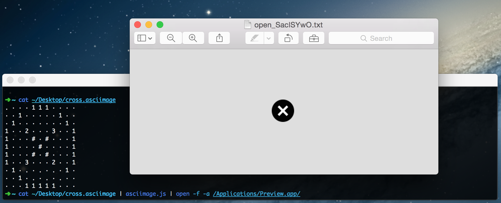

# node-cocoscii

This is a Node.js version of the [javascript (ES2015) version](https://github.com/mrspeaker/cocoscii) of [ASCIImage](http://asciimage.org/) by [Charles Parnot](http://twitter.com/cparnot). ASCIImage lets you create icons by defining some control points for drawing lines, paths, and circles. You can also style each shape individually. [Read all about the original project](http://cocoamine.net/blog/2015/03/20/replacing-photoshop-with-nsstring/), then read about [cocoscii](https://github.com/mrspeaker/cocoscii), then come back here.

# Try it out!

`node-cocoscii` includes a commandline tool `bin/saciimage.js` for translating .asciimage files into png. It accepts .asciimage data via stdin, and outputs to its stdout a PNG image representation of the image.

```
npm install -g node-cocoscii
cat ./examples/cross.asciimage | asciimage.js | open -f -a /Applications/Preview.app
```

You'll see something like as follows:




There are also a number of other implementations of ASCIImage available at [ASCIImage.org](http://asciimage.org).
